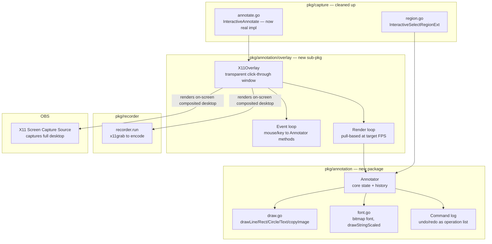
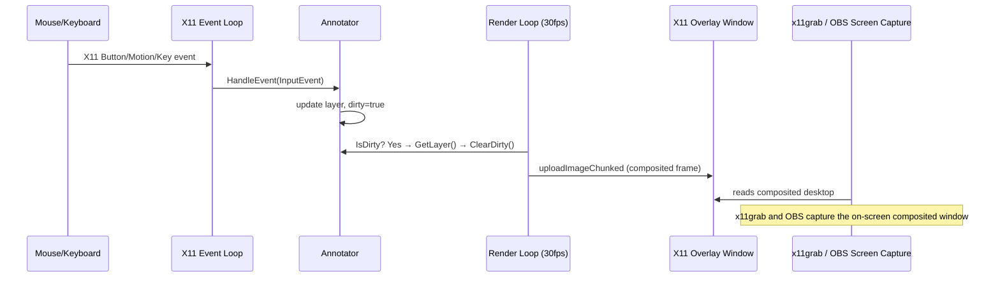

# Architecture Plan: `pkg/annotation` — Decoupled Realtime Screen Annotation

## Summary

`NotationState` in `pkg/capture/notations.go` is hard-coupled to the `pkg/capture` package internals (shared draw helpers, X11 plumbing) and can only be instantiated inside the screenshot region-select flow. The goal is to extract it into a standalone `pkg/annotation` package with a clean, X11-agnostic core, and attach a **single rendering path** — a transparent X11 overlay window — that works across both the existing Recorder mode and OBS screen-capture mode without requiring separate per-mode frame hooks or a V4L2 pipeline. This plan covers the refactor boundaries, data flow, concurrency model, failure handling, key decisions, and red-team critique disposition.

---

## System Boundaries and Component Breakdown



**Key principle:** the X11Overlay window is a real on-screen composited window. Both `x11grab` (Recorder) and OBS's X11 capture source see it as part of the desktop — no frame hooks, no V4L2 loopback, no per-mode pixel surgery.

---

## Package Structure

```
pkg/annotation/
    annotator.go      — Annotator struct, public API
    draw.go           — drawLine, drawRect, drawCircle, drawHUDTextScaled, copyImage
    font.go           — bitmap font data, drawStringScaled
    command.go        — Command interface, StrokeCmd, TextCmd, UndoLog
    types.go          — Tool, Config, Event types

pkg/annotation/overlay/
    overlay.go        — X11Overlay: window creation, composite transparency, click-through
    event_loop.go     — X11 event to Annotator dispatch
    render_loop.go    — pull-based dirty-flag render at configurable FPS
```

Files **removed** from `pkg/capture/`:
- `draw.go` → moved to `pkg/annotation/draw.go`
- `font.go` → moved to `pkg/annotation/font.go`
- `notations.go` → replaced by `pkg/annotation/annotator.go`
- `annotate.go` → re-implemented using `pkg/annotation/overlay`

`pkg/capture/x11.go` (`imageToBGRA`, `uploadImageChunked`) stays in `pkg/capture` — it is used by `region.go`'s preview loop. `pkg/annotation/overlay` imports these functions directly or gets its own copies.

---

## Core API (`pkg/annotation`)

```go
// Tool selects the active annotation mode.
type Tool int
const (
    Doodle Tool = iota
    Rect
    Circle
    Text
)

// Config holds brush/font settings.
type Config struct {
    BrushThickness uint32
    FontScale      int
    Color          color.RGBA
}

// InputEvent is a platform-agnostic event delivered by the overlay or tests.
type InputEvent struct {
    Kind    EventKind     // Press, Release, Motion, Key
    X, Y   int
    Button  int           // 1=left, 3=right; 0 for key events
    Mods    uint16        // X11 modifier mask
    KeyStr  string
    Keycode uint8
}

// Annotator manages annotation state. All public methods are goroutine-safe.
type Annotator struct {
    mu      sync.Mutex
    base    *image.RGBA   // original unmodified frame (for compositing)
    layer   *image.RGBA   // current annotation layer (RGBA, transparent bg)
    log     UndoLog       // command-based undo; see command.go
    tool    Tool
    cfg     Config
    dirty   atomic.Bool   // set on any mutation, cleared by renderer
    // transient state (protected by mu)
    doodling        bool
    doodleStart     image.Point
    doodleLast      image.Point
    textActive      bool
    textAnchor      image.Point
    textBuffer      string
    lastRightClick  time.Time
}

// NewAnnotator creates an Annotator over the given base image.
// layer is initialized as transparent RGBA same size as base.
func NewAnnotator(base *image.RGBA, cfg Config) *Annotator

// HandleEvent dispatches an InputEvent and updates internal state.
// Returns (consumed bool, needsRedraw bool).
func (a *Annotator) HandleEvent(ev InputEvent) (bool, bool)

// GetLayer returns a snapshot copy of the current annotation layer.
// Safe to call from any goroutine; never returns a live pointer.
func (a *Annotator) GetLayer() *image.RGBA

// GetComposite returns a snapshot of base composited with the annotation layer.
func (a *Annotator) GetComposite() *image.RGBA

// IsDirty reports whether annotations have changed since last ClearDirty.
func (a *Annotator) IsDirty() bool
func (a *Annotator) ClearDirty()

// Undo pops the last committed command.
func (a *Annotator) Undo()
```

**Critical design choices:**
1. `GetLayer()` / `GetComposite()` always return a **copy**, never a live `*image.RGBA`. Prevents pointer-escape-past-lock bugs.
2. `dirty atomic.Bool` (poll model) instead of `onChange func(...)` callback (push model). Renderers check `IsDirty()` on their own clock. Eliminates reentrancy deadlock and synchronous-callback-on-hot-path problems.
3. Annotation drawn onto a **transparent `layer`** separate from `base`. Compositing deferred to renderer. Enables undo by command replay over a clean layer.

---

## Undo History: Command Log, Not Snapshot List

> [!WARNING]
> The original `history []*image.RGBA` snapshot approach is O(W×H) memory per operation. At 1920×1080 RGBA that is ~8 MB per snapshot; a rapid freehand session can accumulate hundreds of MB in seconds.

**Replacement:** a `UndoLog` storing operation descriptors.

```go
// pseudo-types
type Command interface{ apply(layer *image.RGBA, cfg Config) }

type StrokeCmd struct {
    Points []image.Point
    Color  color.RGBA
    Thick  int
    Tool   Tool // Doodle / Rect / Circle
}
type TextCmd struct {
    Anchor    image.Point
    Text      string
    Color     color.RGBA
    FontScale int
}
```

On Undo: `layer` cleared (transparent fill), all commands except last replayed in order. O(N×W×H) where N is command count — typically small (<20), and replay happens at most once per Undo.

On commit (button-release or Enter for text): `StrokeCmd` or `TextCmd` appended to log; `dirty` set.

---

## X11 Overlay (`pkg/annotation/overlay`)

### Window Properties
- **`_NET_WM_WINDOW_TYPE_DOCK`** or `UTILITY` — bypasses window manager decoration.
- **`_NET_WM_STATE_ABOVE`** — always-on-top.
- **`_XSHAPE`** extension `ShapeInput` set to empty rectangle — click-through by default; toggled by hotkey when annotation mode is active.
- **Alpha channel** via ARGB visual (requires compositor; see Failure Modes).
- Positioned to cover the annotation target region exactly.

### Event Loop (`event_loop.go`)

```
XUtil event loop goroutine:
  for each X11 event:
      ev → InputEvent (platform-agnostic conversion)
      a.HandleEvent(ev)
      // dirty flag set by Annotator if needed; renderer sees it next tick
```

No callbacks fired from inside `HandleEvent`. The event goroutine never holds `Annotator.mu` while calling out.

### Render Loop (`render_loop.go`)

```
ticker := time.NewTicker(1000ms / targetFPS)  // e.g. 30fps
for range ticker.C:
    if !a.IsDirty() {
        continue   // skip; zero X11 cost
    }
    layer := a.GetLayer()        // snapshot copy, no lock held during rendering
    a.ClearDirty()
    composite := alphaOver(base, layer)
    bgra := imageToBGRA(composite)
    uploadImageChunked(xu, drawable, gc, depth, w, h, bgra)
    // draw transient preview on top (doodle ghost, text cursor blink)
```

Pull-based, rate-capped. 1000 mouse-motion events/sec → ≤30 composites/sec. `atomic.Bool` dirty flag is the only cross-goroutine coordination.

---

## Data Flow



---

## Integration Points

### Recorder Mode

No changes to `pkg/recorder/recorder.go` frame pipeline. The overlay is on-screen and x11grab captures it automatically.

Wire-up in `record.go#handleRecord`:
```
ann := annotation.NewAnnotator(nil, cfg)   // nil base = transparent-only mode
ov  := overlay.NewX11Overlay(ann, captureRegion, display)
ov.Start()
defer ov.Stop()
rec.Start()
```

A hotkey (integrated with `pkg/automation` or via `xgbutil` global grab) toggles XShape input mask so the user can annotate without losing keyboard/mouse to the underlying app.

### OBS Mode

OBS → X11 Screen Capture source. Overlay window is on the composited desktop, OBS captures it.

> [!IMPORTANT]
> Only works with a **compositor-aware** OBS capture method (XComposite / PipeWire portal). Raw XShm direct framebuffer grab will not see the composited ARGB overlay. See Failure Mode #2.

V4L2 loopback path evaluated and rejected — see Key Decisions.

### `pkg/capture` After Refactor

| File | Disposition |
|------|-------------|
| `notations.go` | Deleted — superseded by `pkg/annotation/annotator.go` |
| `draw.go` | Moved to `pkg/annotation/draw.go`; `pkg/automation/picker.go` import updated |
| `font.go` | Moved to `pkg/annotation/font.go` |
| `annotate.go` | Re-implemented: creates `X11Overlay`, runs event loop, returns `GetComposite()` |
| `region.go` | Updated: instantiates `annotation.NewAnnotator`, dispatches `InputEvent` from its own X11 loop |
| `x11.go` | Stays in `pkg/capture`; `pkg/annotation/overlay` imports it directly |

---

## Failure Modes

| # | Failure | Handling |
|---|---------|----------|
| 1 | **Compositor not running** — no ARGB visual | `overlay.NewX11Overlay` checks for ARGB visual; falls back to opaque 24-bit window. Annotations visible but occlude background. Logged warning. |
| 2 | **OBS uses XShm (non-composited) capture** — overlay not seen | Detect at overlay creation: if `_NET_WM_COMPOSITE_MANAGER_RUNNING` absent, warn user. Document OBS must use PipeWire/XComposite source. |
| 3 | **GetLayer() called during rapid Undo replay** | `mu` held for entire replay pass; `GetLayer()` waits. Acceptable: Undo is rare, replay is fast (<5ms for typical N). |
| 4 | **Dirty flag set but render loop stopped** | `Stop()` awaits one final render tick before closing window. |
| 5 | **Capture region moves** (window drag during recording) | Overlay anchored at session-start coordinates. Re-anchoring requires overlay restart. Documented limitation. |
| 6 | **Input event arrives during click-through mode** | XShape empty input region discards events to overlay. Hotkey toggles input mode. |
| 7 | **Multiple zen-cap instances** on same display | Each creates its own overlay window; they stack. Not a hard error — documented. |
| 8 | **Display resize** during session | `overlay.X11Overlay` listens for `ConfigureNotify`; re-creates layer at new dimensions, preserves command log. |

---

## Key Decisions

### 1. Single X11 overlay delivery path vs. three mode-specific hooks

**Chosen:** one X11 overlay window on-screen; Recorder and OBS capture it via their existing screen-grab mechanism.

**Rejected — AnnotationHook in RecorderConfig:** Raw-frame round-trip (`astiav.Frame` → `*image.RGBA` → composite → back), thread-affinity risk with FFmpeg codec context, separate coupling surface per consumer.

**Rejected — V4L2 loopback pipeline:** Requires root (kernel module), owns device lifecycle, pixel-format negotiation (YUYV vs RGBA) causes hard OBS "device busy" failures, OBS canvas resize breaks fixed-size loopback. Entirely orthogonal to zen-cap's core value.

**Tradeoff accepted:** single delivery path mandates a running X11 compositor for transparency. Fallback is an opaque window. Acceptable given modern Linux desktop norms (KWin, Mutter, Picom).

### 2. Pull-based dirty-flag render vs. push-based onChange callback

**Chosen:** `atomic.Bool` dirty flag, polled by ticker-driven render goroutine.

**Rejected:** `onChange func(*image.RGBA)` callback. Creates reentrancy deadlock risk (callback calls back into Annotator while mu held), stalls input thread on renderer latency, and drives 1000 composites/sec from mouse-motion events.

### 3. Command-log undo vs. snapshot list

**Chosen:** command log; replay on undo. O(N) memory, N = command count (small).

**Rejected:** `[]*image.RGBA` snapshot per stroke. ~8 MB/snapshot at 1080p — exhausted in seconds.

### 4. Separate annotation layer vs. mutating base in-place

**Chosen:** separate transparent layer; `GetComposite()` combines on demand.

**Rejected:** mutating base. Undo requires reverting pixels (impossible without full snapshots) or command replay (which requires separate layer anyway).

### 5. Coordinate space

Annotation input coordinates match the overlay window's coordinate space, which matches the x11grab capture region. The coordinate-mismatch problem only applies to the rejected V4L2 path where OBS canvas resolution can differ from screen resolution.

---

## Red-Team Critique Disposition

Critique source: `browser.chat` (Claude), 2026-07-12.

| Critique | Disposition |
|----------|-------------|
| Three bespoke integration pipelines multiply failure surfaces | **Folded in.** Revised to single X11 overlay path. |
| Reentrancy deadlock: onChange fires while mu held, callback calls GetImage | **Folded in.** onChange replaced by dirty flag; GetLayer() returns copy after releasing mu. |
| Pointer escape past lock: stashed *image.RGBA read while being mutated | **Folded in.** GetLayer() / GetComposite() always return snapshot copies. |
| Synchronous onChange in hot loop stalls input thread | **Folded in.** Pull-based render ticker decouples render rate from input rate. |
| Lock contention: 3 consumers at different clocks fighting RWMutex | **Folded in.** Single render goroutine; mu held only for GetLayer() snapshot. |
| Coordinate space mismatch for OBS canvas ≠ screen resolution | **Rejected for the chosen path.** Only relevant for V4L2 pipeline (rejected). X11 overlay operates in screen-pixel space. |
| V4L2 pixel format issues, loopback privilege/singleton, OBS canvas resize | **Rejected** (V4L2 path rejected entirely). These failure modes are the reason V4L2 was dropped. |
| Mode C (X11 overlay + OBS XShm) may not work | **Folded in.** Failure Mode #2 explicitly addresses XShm detection and OBS source requirement. |
| AnnotationHook missing error return | **N/A** — AnnotationHook not in final design. |
| Undo snapshot list memory O(W×H) per operation | **Folded in.** Command-log undo (Decision #3). |
| Push-based onChange causes 3× over-compositing vs framerate | **Folded in.** Pull-based dirty-flag model (Decision #2). |
| Simpler alternative: X11 overlay captured by x11grab for free | **Folded in.** This is now the primary architecture. |
| Don't own V4L2 pipeline — use OBS native overlays | **Folded in as rationale** for rejecting V4L2. OBS Browser Source noted as future extension, not in scope. |

---

## Open Questions

1. **[UNCERTAIN]** Does the target deployment run a compositor? If not, should `overlay.Start()` hard-fail or degrade gracefully with an opaque window?
> Ideally I want the live anotation to be live compatible (no freezing screen live capturing - for valid purpose)
2. **[UNCERTAIN]** Which OBS capture source is configured — XShm, XComposite, or PipeWire portal? Needs confirmation before Mode B (OBS) is marked fully supported.
> Focus on compatibility with pkg/recorder first, OBS next.
3. Input toggle hotkey: integrate with existing `pkg/automation` hotkey system, or maintain an independent `xgbutil` global grab in the overlay?
> Existing hotkey system, as it's matured
4. Should `InteractiveAnnotate` (pipeline `edit_task.go`) and the realtime overlay share one `Annotator` instance, or are they always independent sessions?
> Choose easier and flexible solution
5. `pkg/capture/x11.go` dependency from `pkg/annotation/overlay`: (a) import directly, (b) copy into overlay, or (c) extract into a shared `pkg/x11` utility? Option (a) works now; revisit if import cycles emerge.
> Keep as is and we will focus on it later
---

## Implementation Phases

| Phase | Scope | Files |
|-------|-------|-------|
| 1 | Create `pkg/annotation` core: move draw/font, implement `Annotator`, `UndoLog`, `InputEvent` | `pkg/annotation/*.go` (new) |
| 2 | Update `pkg/capture/region.go`: replace `NotationState` with `annotation.Annotator` + `InputEvent` dispatch | `region.go`, delete `notations.go` |
| 3 | Implement `pkg/annotation/overlay`: X11Overlay window, event loop, render loop | `pkg/annotation/overlay/*.go` (new) |
| 4 | Re-implement `pkg/capture/annotate.go#InteractiveAnnotate` using overlay | `annotate.go` |
| 5 | Wire overlay start/stop into `record.go#handleRecord` for Recorder mode | `record.go` |
| 6 | Update `pkg/automation/picker.go` import path for moved `drawRect` | `picker.go` |
| 7 | Delete `pkg/capture/draw.go`, `pkg/capture/font.go`, `pkg/capture/notations.go` | — |
