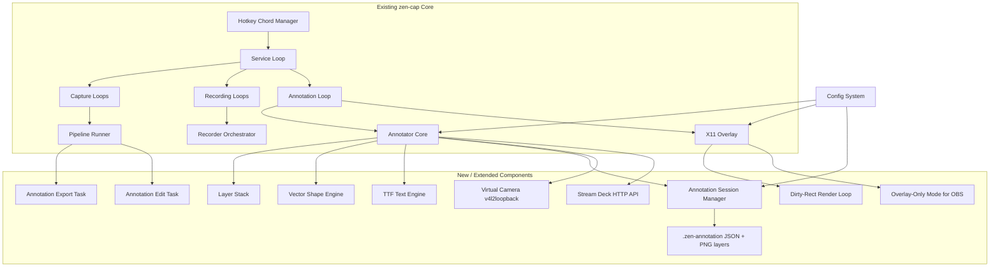
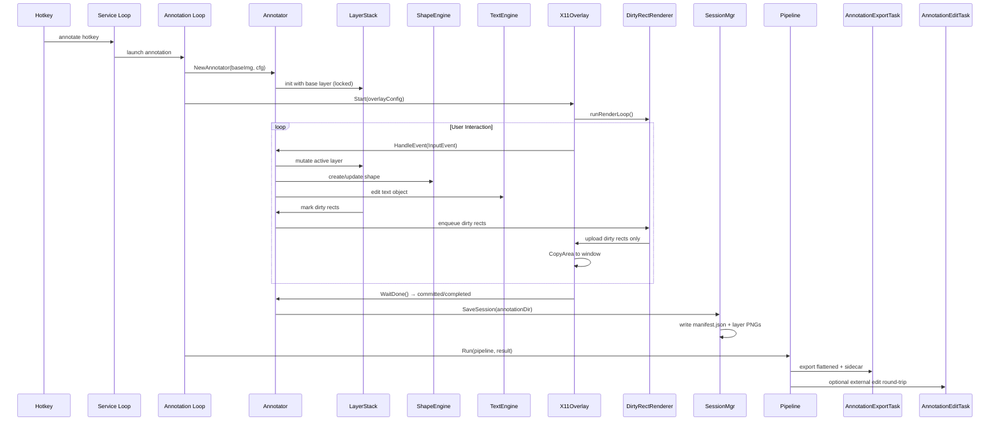

# Architecture Plan: pkg/annotation Overlay Improvements for Post-Process Editing & Live Tutorial Streaming

## Summary

This plan proposes targeted improvements to `pkg/annotation` to make it practical for two distinct workflows: (1) post-capture image editing (multi-layer annotations, vector shapes, editable text, session persistence) and (2) live tutorial streaming with OBS (low-latency overlay, virtual camera output, Stream Deck integration). The design stays within zen-cap's existing architecture — hotkey-driven service loops, pipeline tasks, X11 double-buffered overlays — and deliberately avoids building a full image editor. Instead, it layers minimal, composable capabilities onto the existing `Annotator`/`X11Overlay` core, reusing the pipeline/task system for export/persistence and the config system for defaults.

---

## System Boundaries & Component Breakdown



### Key Component Responsibilities

| Component | Responsibility | New/Extended |
|-----------|----------------|--------------|
| `Annotator` | Core event handling, tool state, undo log | **Extended** — delegates to LayerStack, ShapeEngine, TextEngine |
| `LayerStack` | Ordered layer list, blend modes, visibility, lock, per-layer undo | **New** |
| `ShapeEngine` | Vector shapes (rect, ellipse, arrow, line, polygon), hit-testing, transform handles | **New** |
| `TextEngine` | TTF font rendering (bundled font), multi-line, inline editing, IME support | **New** (replaces bitmap font) |
| `SessionMgr` | Persist/load `.zen-annotation` session (JSON manifest + PNG layers) | **New** |
| `AnnotationExportTask` | Pipeline task: export flattened PNG + optional SVG/JSON sidecar | **New** (pipeline task) |
| `AnnotationEditTask` | Pipeline task: launch external editor (Inkscape/GIMP) with sidecar, watch for changes, re-import | **New** (pipeline task) |
| `DirtyRectRenderer` | Track dirty rects per frame; upload only changed regions to X11 | **Extended** render loop |
| `OverlayOnlyMode` | Transparent ARGB overlay window (no base image), captures via OBS window capture | **Extended** overlay config |
| `VirtualCam` | Optional v4l2loopback writer for non-OBS consumers (gated behind feature flag) | **New** (optional) |
| `StreamDeckAPI` | Local HTTP endpoint for Stream Deck buttons (tool switch, undo, color, snapshot) | **New** (optional) |

---

## Data Flow & State Management



### State Ownership & Concurrency Model

**Single-writer actor model** (addresses red-team concurrency critique):

```
┌─────────────────────────────────────────────────────────────┐
│                     Annotator Actor (single goroutine)      │
│  ┌─────────────┐  ┌─────────────┐  ┌─────────────────────┐  │
│  │ Event Chan  │→ │ Mutate State│→ │ Dirty Rect Chan     │  │
│  │ (X11 events,│  │ (LayerStack,│  │ (to render loop)    │  │
│  │  hotkeys,   │  │  ShapeEngine,│  └─────────────────────┘  │
│  │  StreamDeck)│  │  TextEngine) │          │                │
│  └─────────────┘  └─────────────┘          ▼                │
│                                           ┌─────────────┐   │
│                                           │ Render Loop │   │
│                                           │ (reads only │   │
│                                           │  immutable  │   │
│                                           │  snapshots) │   │
│                                           └─────────────┘   │
└─────────────────────────────────────────────────────────────┘
```

- **Event sources** (X11 event loop, global hotkeys, Stream Deck HTTP) all send to a single `eventChan chan InputEvent` owned by the Annotator goroutine.
- **Render loop** runs on a separate goroutine but only reads *immutable snapshots* (`LayerStack.Snapshot() LayerSnapshot`) produced by the actor after each mutation batch.
- **No shared mutable state** between event handling and rendering — eliminates X11 connection thread-safety issues and race conditions from Stream Deck/hotkey concurrent mutations.

---

## Failure Modes & Mitigations

| Failure Mode | Detection | Mitigation | Fallback |
|--------------|-----------|------------|----------|
| **No compositor (ARGB visual fails)** | `findARGBVisual` returns 0 on overlay start | Detect at `Start()`; auto-fallback to chroma-key overlay (magenta key color) + shaped window | Overlay-only mode with chroma key; document OBS color key filter setup |
| **v4l2loopback not loadable** | `mod fails /dev/videoN` open fails | Feature-flagged (`enable_virtual_camera: false` default); graceful degradation with clear log | Overlay-only + OBS window capture; virtual camera explicitly opt-in |
| **TTF font missing/corrupt** | `sfnt.Parse` error on bundled font load | Bundled `DejaVuSans.ttf` embedded via `go:embed`; hard fallback to existing 5x7 bitmap font | Bitmap font rendering (current behavior) |
| **4K @ 60fps X11 bandwidth saturation** | Frame time > 16ms consistently | Dirty-rect tracking (required); if still > frame budget, auto-throttle to 30fps + log warning | Configurable `max_fps` cap; user can lower capture resolution |
| **Layer memory OOM (15+ 4K layers)** | `runtime.ReadMemStats` shows >80% heap | Hard cap: `max_layers = 12` (configurable); inactive layers auto-flatten to base; warning notification | User can export/flatten to continue |
| **Undo stack unbounded growth** | `UndoLog.Len() > max_undo_depth` (default 200) | Ring-buffer undo log; compaction: merge consecutive freehand points into single stroke command every N points | Configurable `undo_depth`; persist compressed history in session |
| **External editor round-trip fails** | File watch timeout / parse error on re-import | Pipeline task returns error; original annotation preserved; user notified | Manual re-import via hotkey |
| **X11 connection lost (display sleep/switch)** | `xgbutil` connection error on render | Detect in render loop; attempt reconnect once; if failed, save session auto-save and exit cleanly | Session recovery on next annotate hotkey |

---

## Key Decisions & Alternatives Considered

| Decision | Chosen Approach | Alternative Considered | Rejection Rationale |
|----------|-----------------|------------------------|---------------------|
| **Layer model** | Simple ordered stack (base + annotation layers), single blend mode (Normal), per-layer visibility/lock | Full Photoshop-style: groups, blend modes (multiply, screen, etc.), adjustment layers, masks | Scope creep; 80/20 achieved with ordered stack + opacity. External editor round-trip covers advanced needs. |
| **Vector shapes** | Immutable shape objects (Rect, Ellipse, Arrow, Line, Polygon) with transform matrix; hit-test via bounding box + precise path test | Immediate-mode drawing to raster layer (current `StrokeCmd` approach) | Vector enables resize/rotate/edit post-commit; raster-only loses editability. Minimal overhead: shapes render to layer on composite. |
| **Text engine** | Bundled TTF (DejaVuSans via `go:embed`), multi-line via `\n`, inline editing with IME support via `golang.org/x/image/font` | Keep bitmap font (5x7) with scale; or full fontconfig/system font lookup | Bitmap font doesn't scale cleanly; fontconfig adds CGO dependency and deployment complexity. Bundled TTF = zero-config, consistent rendering. |
| **Session persistence** | `.zen-annotation/` dir: `manifest.json` (layers, shapes, text, transforms, tool state) + `layer_N.png` (rasterized per layer) | Single flattened PNG + SVG sidecar; or custom binary format | Per-layer PNG enables resumable editing without re-rasterizing base; JSON is human-readable/debuggable. Fits existing config YAML/JSON patterns. |
| **OBS integration** | Overlay-only ARGB mode (transparent window, no base image) captured via OBS Window Capture; virtual camera gated behind opt-in feature flag | Full v4l2loopback virtual camera as primary; or PipeWire screen capture with annotation overlay composited | ARGB overlay + OBS window capture works on all compositors, zero kernel deps, lowest latency. Virtual camera is niche (non-OBS consumers) and fails on locked-down kernels. |
| **Stream Deck / external control** | Local HTTP server (`:17391/annotate/*`) with simple JSON API; auth via loopback-only + token file | WebSocket; or D-Bus; or direct X11 property messages | HTTP is simplest for Stream Deck plugins, OBS WebSocket scripts, custom macros. Loopback-only = no network exposure. |
| **Render pipeline** | Dirty-rect tracking + double-buffered X11 pixmap (existing pattern); render loop reads immutable snapshot from actor | Full GPU compositing via EGL/OpenGL on X11 | GPU path adds EGL dependency, fails on headless/remote X, no fallback. Dirty-rect solves 90% of bandwidth issue with existing X11 primitives. |
| **Pipeline integration** | Two new `pipeline.Task` implementations: `AnnotationExportTask` (flatten + sidecar) and `AnnotationEditTask` (external editor round-trip) | Extend `EditTask` to handle annotations internally | Keeps annotation logic out of generic `EditTask`; follows existing task-per-concern pattern. |

---

## Red-Team Critique Summary (from browser.chat)

| # | Critique | Resolution |
|---|----------|------------|
| 1 | **No compositor fallback for ARGB overlay** | **Folded in** — chroma-key fallback (magenta) + shaped window documented in failure modes; overlay start detects and auto-switches. |
| 2 | **v4l2loopback not universally available** | **Folded in** — virtual camera is opt-in feature flag (`enable_virtual_camera: false` default); overlay-only mode is primary OBS path. |
| 3 | **GPU/EGL path fails on remote/headless X** | **Rejected: GPU compositing not in plan** — dirty-rect tracking is the primary optimization; no EGL dependency introduced. |
| 4 | **TTF font loading needs resolution strategy** | **Folded in** — bundled DejaVuSans via `go:embed` with bitmap font fallback; no fontconfig. |
| 5 | **No OOM guard for layer memory** | **Folded in** — hard cap `max_layers=12`, auto-flatten inactive layers, memory pressure warning. |
| 6 | **4K@60fps X11 bandwidth; dirty-rect is prerequisite, not optional** | **Folded in** — dirty-rect tracking is mandatory in render loop design; frame budget monitoring with auto-throttle. |
| 7 | **Undo stack unbounded** | **Folded in** — ring-buffer with configurable depth (default 200); stroke compaction every N points. |
| 8 | **Concurrency model unspecified (X11 + hotkeys + Stream Deck)** | **Folded in** — single-writer actor model with event channel; render loop reads immutable snapshots. Explicitly documented. |
| 9 | **Build mini-Photoshop vs. round-trip external editor** | **Folded in** — plan uses simple layer stack + external editor round-trip via `AnnotationEditTask`; no blend modes, masks, adjustment layers. |
| 10 | **Inline text editing complexity vs. value** | **Folded in** — multi-line via explicit `\n` only; no word-wrap; inline edit supported but simple (click to re-edit committed text). IME handled by `ximage/font`. |
| 11 | **Virtual camera as primary OBS path** | **Rejected** — overlay-only ARGB + OBS Window Capture is primary; virtual camera is opt-in feature flag. |
| 12 | **Full session versioning vs. simple resume** | **Folded in** — single-session resume (latest `.zen-annotation`); no timeline scrubber or version history. |
| 13 | **Pipeline/task integration missing** | **Folded in** — two new pipeline tasks (`AnnotationExportTask`, `AnnotationEditTask`) explicitly designed. |
| 14 | **New dependencies violate minimal-dep ethos** | **Partially folded in** — adds `golang.org/x/image/font` (stdlib-adjacent) and bundled TTF; no CGO, no fontconfig. v4l2loopback is opt-in kernel module, not Go dep. |
| 15 | **Locking strategy for shared layer stack** | **Folded in** — actor model eliminates shared mutable state; render loop gets snapshot copy. |

---

## Open Questions / Confidence < 85%

| Topic | Uncertainty | Next Step |
|-------|-------------|-----------|
| **IME composition on X11** | `golang.org/x/image/font` doesn't handle IME; need `xgb`/`xgbutil` key events + preedit buffer. Current `KeyPress` handling in overlay may not compose correctly for CJK. | Prototype IME handling in isolation; if complex, defer to "click text tool again to re-edit" fallback for v1. |
| **Arrow/pointer shape geometry** | Arrowhead math (angle, size relative to stroke width) needs design; polygon hit-test for rotated arrows. | Define arrow as `Line + Arrowhead{size, angle}`; implement hit-test via shapely-style point-in-polygon. Low risk. |
| **External editor file format** | `AnnotationEditTask` needs a round-trippable format. SVG is standard but doesn't preserve layer structure / text editability well. JSON sidecar + flattened PNG is lossy for vector. | Use `.zen-annotation` session dir as the exchange format; external editor opens manifest, user edits, saves back. Editor integration is "open folder in Inkscape/GIMP" — user manages layers manually. Acceptable for v1. |
| **Stream Deck API surface** | Minimal set: `tool`, `color`, `undo`, `snapshot`, `toggle_visibility`. May need per-profile tool palettes. | Start with 5 endpoints; add profile switching if users request. |
| **Multi-monitor annotation** | Current overlay takes single `X,Y,W,H`; multi-monitor spans multiple X screens or one large Xinerama/Randr surface. | Leverage existing `pkg/magnifier/monitors.go` detection; overlay spans virtual screen bounds. Test on dual-head. |
| **Session auto-save interval** | Crash recovery needs periodic save; but saving PNG layers is I/O heavy. | Auto-save manifest (JSON) every 30s; full layer PNGs only on explicit commit or session end. Manifest enables fast resume. |

---

## Implementation Phasing (Suggested)

| Phase | Scope | Deliverable |
|-------|-------|-------------|
| **1. Foundation** | Actor model event loop, LayerStack (base + 1 annotation layer), dirty-rect render loop, session manifest save/load | Working annotation with layers, resume, no vector shapes yet |
| **2. Vector Shapes** | ShapeEngine: Rect, Ellipse, Line, Arrow, Polygon; transform handles; hit-test; per-shape undo | Editable vector annotations |
| **3. Text Engine** | Bundled TTF, multi-line, inline edit, IME best-effort | Professional text annotations |
| **4. OBS Integration** | Overlay-only ARGB mode, chroma-key fallback, Stream Deck HTTP API | Live tutorial streaming ready |
| **5. Pipeline Tasks** | `AnnotationExportTask` (PNG + SVG/JSON sidecar), `AnnotationEditTask` (external editor round-trip) | Post-process workflow integrated |
| **6. Virtual Camera (opt-in)** | v4l2loopback writer behind feature flag | Non-OBS consumers |
| **7. Polish** | Memory guards, undo compaction, auto-save tuning, multi-monitor testing, config docs | Production-ready |

---

## Config Additions (pkg/config/config.go)

```go
type AnnotationConfig struct {
	// Layer limits
	MaxLayers         int     `json:"max_layers"`          // default: 12
	MaxUndoDepth      int     `json:"max_undo_depth"`      // default: 200
	
	// Rendering
	TargetFPS         int     `json:"target_fps"`          // default: 30
	DirtyRectTracking bool    `json:"dirty_rect_tracking"` // default: true
	AutoThrottleFPS   bool    `json:"auto_throttle_fps"`   // default: true
	
	// Text
	FontPath          string  `json:"font_path"`           // empty = bundled DejaVuSans
	DefaultFontScale  int     `json:"default_font_scale"`  // default: 4
	
	// OBS / Streaming
	OverlayOnlyMode   bool    `json:"overlay_only_mode"`   // default: false
	ChromaKeyFallback bool    `json:"chroma_key_fallback"` // default: true
	EnableVirtualCam  bool    `json:"enable_virtual_cam"`  // default: false
	VirtualCamDevice  string  `json:"virtual_cam_device"`  // default: "/dev/video20"
	
	// Stream Deck API
	StreamDeckEnabled bool    `json:"stream_deck_enabled"` // default: false
	StreamDeckPort    int     `json:"stream_deck_port"`    // default: 17391
	StreamDeckToken   string  `json:"stream_deck_token"`   // auto-generated if empty
	
	// Session
	AutoSaveInterval  int     `json:"auto_save_interval"`  // seconds, default: 30
	SessionDir        string  `json:"session_dir"`         // default: "$OUTPUT_DIR/annotations"
}
```

---

## File Structure Changes

```
pkg/annotation/
├── types.go           # + Layer, Shape, TextObject, ToolConfig
├── annotator.go       # → Actor model: eventChan, snapshot(), layerStack
├── command.go         # + ShapeCmd, TextCmd, TransformCmd, LayerCmd
├── draw.go            # + drawShape, drawTextTTF (delegates to engines)
├── font.go            # DEPRECATED → keep for bitmap fallback
├── layer_stack.go     # NEW: LayerStack, LayerSnapshot, blend/composite
├── shape_engine.go    # NEW: Shape types, hit-test, render to layer
├── text_engine.go     # NEW: TTF layout, inline edit, IME handling
├── session.go         # NEW: SessionMgr, manifest JSON, layer PNG I/O
├── pipeline_tasks.go  # NEW: AnnotationExportTask, AnnotationEditTask
├── streamdeck.go      # NEW: HTTP API server (opt-in)
├── virtualcam.go      # NEW: v4l2loopback writer (opt-in, build tag)
└── overlay/
    ├── overlay.go     # + OverlayOnlyMode, chroma-key fallback
    ├── render_loop.go # → dirty-rect tracking, snapshot reader
    └── x11util.go     # + chroma-key window shape helper
```

---

## Confidence Labels

- **>85%**: Actor model, dirty-rect render loop, layer stack basics, session manifest, pipeline tasks, overlay-only mode, Stream Deck HTTP API structure
- **70-85%**: [UNCERTAIN] TTF text engine with IME, arrow/polygon hit-test precision, multi-monitor overlay spanning, virtual camera v4l2loopback stability
- **<70%**: [HYPOTHESIS] External editor round-trip UX (depends on editor capabilities), auto-throttle FPS heuristic tuning, memory pressure auto-flatten behavior under load