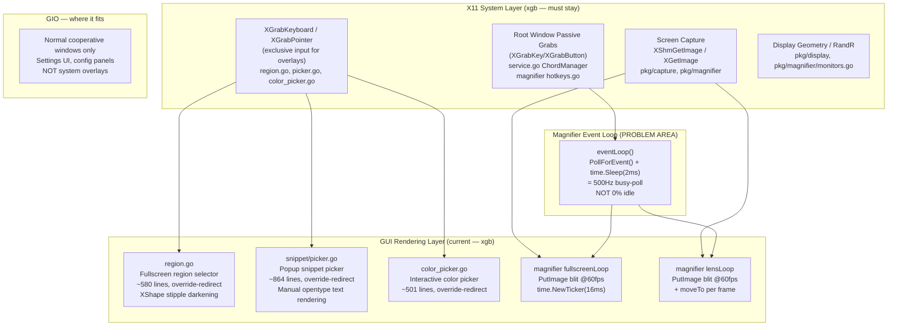
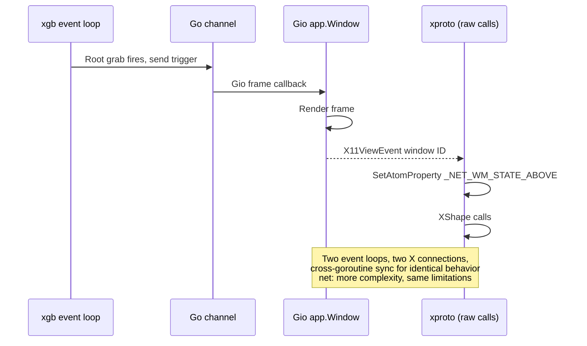

# Architecture Plan: Gio GUI Migration Analysis — zen-cap

## Summary

zen-cap is a Linux X11 screenshot and capture tool whose GUI layer (region selector, snippet picker, color picker, magnifier overlay) is built entirely on raw xgb/xgbutil using the **Interactive Overlay Pattern**: override-redirect windows bypass the WM, combined with `XGrabKeyboard`/`XGrabPointer` for exclusive input and passive root-window grabs for global hotkeys.

The objective is to determine whether replacing this GUI layer with Gio (gioui.org) achieves 0% idle CPU without the busy-polling drawbacks of Fyne/ebiten — and if so, to produce a migration architecture. **Conclusion: NO-GO for Gio migration.** The idle CPU problem is real but localized to one loop in `pkg/magnifier/magnifier.go` and is fixable in-place without any toolkit change.

---

## System Boundaries & Component Breakdown



---

## Idle CPU — Ground Truth

| Component | Current idle behavior | Truly 0% idle? |
|---|---|---|
| `region.go` | `xevent.Main(xu)` blocks on `XNextEvent` | Yes |
| `snippet/picker.go` | `xevent.Main(xu)` blocks on `XNextEvent` | Yes |
| `color_picker.go` | Same pattern as region/picker | Yes |
| `magnifier.eventLoop()` | `PollForEvent()` + `time.Sleep(2ms)` | No — 500Hz spin |
| `magnifier.fullscreenLoop` | `time.NewTicker(16ms)` active mode only | N/A — intentional render loop |

> [!IMPORTANT]
> `region.go`, `picker.go`, and `color_picker.go` are **already 0% idle** today using xgb's blocking `xevent.Main`. Gio would be a lateral move for these three. Only `magnifier.eventLoop()` has the idle CPU problem, and it is fixable without any toolkit change.

---

## Per-Component Gio Feasibility

| Component | Feasibility | Hard blocker |
|---|---|---|
| `pkg/capture/draw.go` (Bresenham primitives) | 10/10 — deletable | Gio `clip`/`paint` replaces entirely |
| `pkg/snippet/picker.go` (rendering) | 7/10 | Font API incompatible; grab pattern breaks |
| `pkg/capture/region.go` | 5/10 | `XGrabKeyboard` + override-redirect required |
| `pkg/capture/color_picker.go` | 5/10 | Same Interactive Overlay Pattern as region.go |
| `pkg/magnifier` render/overlay | 4/10 | XShape input mask, no Gio equivalent |
| `pkg/magnifier` global hotkeys | **0/10 — absolute blocker** | Root-window passive grabs impossible in any toolkit |

---

## The Three Hard Blockers

### Blocker 1 — Global Root-Window Passive Grabs (fatal)

`magnifier.go` registers `XGrabKey`/`XGrabButton` on the **root window** so Mod+Scroll and toggle hotkeys fire regardless of which application has focus. `service.go`'s `ChordManager` does the same for all other bindings.

Gio's `app.Window` only receives events targeted at its own window. There is no API surface to listen on the root window or intercept events when the Gio window is unfocused. This is not a missing convenience feature — it is architecturally outside what a WM-cooperative toolkit window can do on X11, and completely impossible on Wayland (which requires compositor-specific protocols like wlroots layer-shell or the global-shortcuts portal).

**This alone makes full Gio migration impossible for the magnifier and service daemon.**

### Blocker 2 — `XGrabKeyboard`/`XGrabPointer` Exclusive Input

Both `InteractiveSelectRegionExt` and `ShowPicker` explicitly call `xproto.GrabKeyboard`/`GrabPointer` after mapping the overlay window (after `MapNotify`, to avoid a WM-focus race). This guarantees Escape/abort always reaches the overlay even if the WM never grants focus.

Gio has no grab primitive. Input routing is entirely WM/compositor-mediated. On modern compositors that deny focus to unmanaged surfaces, keystrokes including the safety-net abort can silently drop. For a screenshot overlay, **unreliable Escape is a shipped regression**, not a tradeoff.

### Blocker 3 — XShape (bounding + input mask)

`applyWindowShape` in `overlay.go` uses XShape for cosmetic lens cropping (circle/rect). The magnifier overlay windows are intended to be **click-through** — zero input event mask — so mouse events pass to whatever is underneath. Gio exposes no XShape API. Alpha-composited transparency (the only Gio approximation) requires a running compositor AND gives visual transparency without input passthrough.

---

## Hybrid Bridge Analysis — also NO-GO

**Proposed hybrid**: xgb handles grabs/capture, Gio owns window creation and rendering, connected via channels.



| Concern | Verdict |
|---|---|
| Multi-monitor pixel positioning | Workable for static windows; teardown+recreate for cursor-follow (expensive vs current `moveTo`) |
| XShape click-through | No Gio API; must raw-xproto via `X11ViewEvent` anyway |
| Get X11 window ID from Gio | Possible via `app.X11ViewEvent{Window uintptr}` (async, post-map) |
| XGrabKeyboard on Gio window | Window is WM-managed; grab unreliable |
| 60fps PutImage vs GPU blit | GPU path adds texture-upload + composite overhead for pure blit — regression |
| Always-on-top | `ActionRaise` is one-shot; `_NET_WM_STATE_ABOVE` requires raw xproto anyway |
| Font system | `go-text`/Gio shaper vs `golang.org/x/image/font` — incompatible, full rewrite |
| Bridge complexity | Two independent event loops + channel sync vs one xgb goroutine — strictly more parts |

---

## Key Decisions — Alternatives Considered

### Decision 1: Full Gio migration
**Rejected** — Three structural blockers (root grabs, keyboard grabs, XShape) are not gaps in Gio's API. They reflect a fundamentally different window model (WM-cooperative vs override-redirect). The hybrid cannot cleanly separate concerns because Gio owns the platform window end-to-end; attaching external grabs to a WM-managed window does not reproduce override-redirect semantics.

### Decision 2: Fyne / ebiten for GUI
**Rejected** — Both are loop-based, measured at 0.06% idle CPU on 9700x. Disqualified by user requirement.

### Decision 3: Fix the magnifier poll loop in place (SELECTED)
The only component with an actual idle CPU problem is `magnifier.eventLoop()` L192–219. Converting `PollForEvent()` + `time.Sleep(2ms)` to a proper fd-based blocking wait achieves 0% idle — same mechanism that `xevent.Main()` and Gio's own X11 backend use internally — with zero migration risk and zero new dependencies.

---

## The Actual Fix: Magnifier Poll Loop

**Problem** (`magnifier.go` L192–209):

```go
// Current: 500Hz busy-poll
ev, xerr := conn.PollForEvent()   // non-blocking
if ev == nil {
    select {
    case <-s.stopCh:
        s.teardown(); return nil
    default:
        time.Sleep(2 * time.Millisecond)  // spin at 500Hz
        continue
    }
}
```

**Target state** (pseudocode):

```
// fd-based blocking wait — identical to how Gio's X11 backend works
fd       = conn.ConnectionNumber()      // X11 socket fd (int)
stopRd, stopWr = os.Pipe()             // replaces stopCh for cross-fd selection

loop:
    // Block until X event OR stop signal, no timeout
    n = unix.Poll([{Fd: fd, Events: POLLIN}, {Fd: stopRd, Events: POLLIN}], timeout=-1)

    if stopRd is readable:
        teardown(); return nil

    // Drain all queued events (Poll may coalesce multiple)
    for:
        ev, xerr = conn.PollForEvent()
        if ev == nil: break
        dispatch(ev)
```

**Scope of change**: ~20 lines confined entirely to `eventLoop()` in `magnifier.go`. `Stop()` writes one byte to `stopWr` instead of closing `stopCh`. `fullscreenLoop`/`lensLoop` are **unchanged** — their 60fps `time.NewTicker` is correct for active rendering, not idle.

---

## Failure Modes

| Mode | After fix |
|---|---|
| X server disconnect | `unix.Poll` returns `POLLHUP`; treat as terminal error → return |
| Multiple events queued | Drain loop after `Poll` wake flushes all — no event starvation |
| Stop races with event | Poll on both fds simultaneously; whichever fires first is handled cleanly |
| XWayland fd signalling | [UNCERTAIN] Some XWayland versions may not signal `POLLIN` reliably — needs runtime test |
| fullscreenLoop CPU (active) | Unchanged; `time.NewTicker(16ms)` is intentional, this fix does not touch it |

---

## Red-Team Critique Summary

Source: `browser.chat` (Claude), 2× independent analysis passes against 5 uploaded source files.

| Critique | Resolution |
|---|---|
| "region.go/picker.go already use blocking xevent.Main — Gio is lateral, not better for them" | **Folded in** — confirmed via code, only magnifier.eventLoop is the problem |
| "XGrabKeyboard on Gio window is unreliable due to WM focus-follow" | **Folded in** — cited as Blocker 2 |
| "Hybrid bridge: two independent event loops — more complex, not simpler" | **Folded in** — hybrid rejected |
| "PutImage blit is cheaper than GPU texture-upload+composite for magnifier hot path" | **Folded in** — Gio would regress magnifier frame latency |
| "fullscreenLoop/lensLoop use time.NewTicker — intentional active-render, not idle CPU" | **Folded in** — fix correctly scoped to eventLoop only |
| "app.X11ViewEvent exposes window ID — hybrid is partially possible" | **Rejected**: window is still WM-managed, not override-redirect; grabs unreliable; shape calls require raw xproto anyway; net result is more code, same limitations |
| "If cross-platform becomes a goal, Gio is worth it for non-overlay UI (settings window etc.)" | **Folded in as open question** — noted below |

---

## Open Questions

1. **[UNCERTAIN]** Does `unix.Poll` on the xgb connection fd behave correctly under XWayland? Some XWayland implementations have been reported to not signal `POLLIN` reliably. Needs runtime validation on an XWayland session before merging the fix.

2. The pipe-based stop signal requires `stopCh chan struct{}` to be replaced or supplemented with a `[2]*os.File`. Is there appetite to change the `Stop()` API surface, or should the pipe be fully internal?

3. Long-term: if Wayland-native support is ever in scope (wlroots `layer-shell` for overlays, `global-shortcuts` portal for root grabs), that is a full parallel implementation — not a Gio migration. Gio does not expose layer-shell even on Wayland.

4. Rendering quality: if picker/region aesthetics become a priority, better anti-aliased text/icons can be drawn into the **existing** xgb Pixmap pipeline via `golang.org/x/image/vector` — no window model change required.
