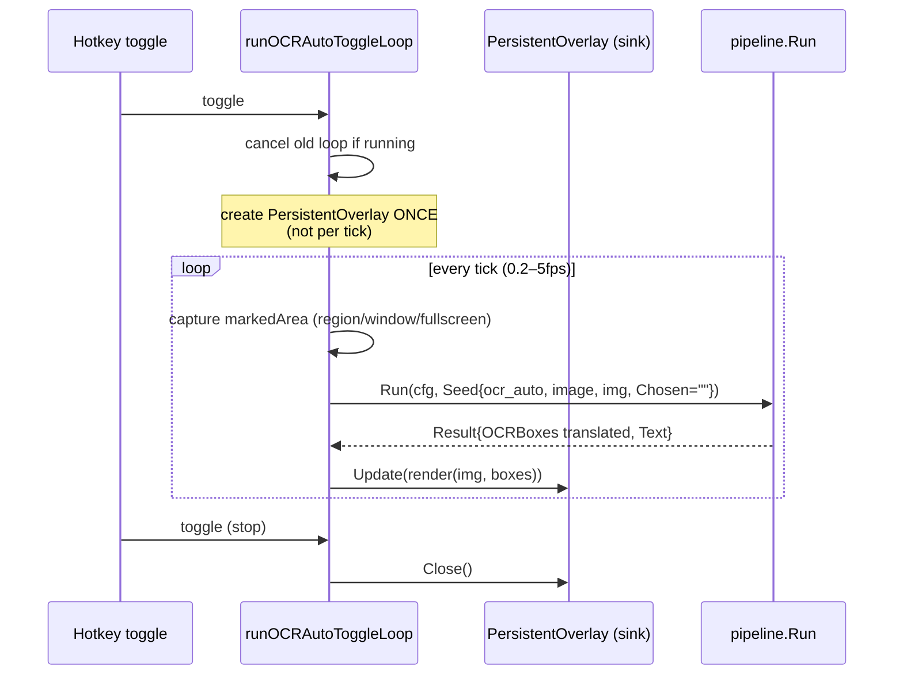

# ARCHITECTURE_PLAN — Generalized Post-Process Pipeline (capture / OCR / OCR-auto / recording)

## Summary

zen-cap's `pkg/pipeline` today is a screenshot-only post-capture chain: a 4-task registry (`edit`, `upload`, `vision`, `clipboard`) over an image+PNG-path `Result`, invoked only by screenshot paths. OCR and recording never use it — OCR runs a monolithic `capture.PerformOCROverlay` (OCR + optional per-box translate + PNG save + *modal blocking X11 window*), and recording runs zero post-processing. The goal is a **single generalized pipeline** with a typed-artifact `Result` (image / file / text) and granular tasks (`ocr`, `translate`, `copy_text`, `copy_path`, `copy_image`, `copy_url`, `copy_llm`, `display`, `display_live`) so chains compose — `["ocr","translate","copy_text"]` — and apply uniformly to screenshots, OCR screenshots, the realtime OCR auto-toggle loop (game-speech translation on a persistent updating overlay), and recordings (copy path + placeholder for more). This is a **breaking config change** (accepted by the user: `ClipboardMode` is dropped, profiles become pure task lists).

---

## System Boundaries & Components

```
┌─────────────────────────────────────────────────────────────────────────────┐
│                               SOURCES (service_*.go)                        │
│  capture │  ocr(shot/region/window) │ ocr_auto (persistent loop) │ record   │
│   │              │                         │  owns                       │
│   │              │                         │  PersistentOverlay           │
│   ▼              ▼                         ▼  (sink)                       ▼
│  ┌───────────────────────────────────────────────────────────────────────┐  │
│  │                     pkg/pipeline  (single engine)                     │  │
│  │   Seed{Source,Kind,Image,FilePath,Chosen} ──► chain resolution ──►   │  │
│  │   [task][task][task]…  each: gate on cfg+artifact, mutate Result       │  │
│  │   Result{Kind, Image, FilePath, Text, OCRBoxes, UploadURL, LLMText,    │  │
│  │           Quiet, Source}                                                │  │
│  │   terminal task (display / display_live) ends the chain                 │  │
│  └───────────────────────────────────────────────────────────────────────┘  │
│       │                    │                     │                          │
│       ▼                    ▼                     ▼                          │
│  clipboard           OCR/LLM server       X11 overlay (modal / persistent)  │
│  (SpawnClipboardDaemon)                    └─ capture.PersistentOverlay     │
└─────────────────────────────────────────────────────────────────────────────┘
```

### Component breakdown

| Component | Responsibility | Change |
|---|---|---|
| `pipeline.Result` | Typed artifact passed between tasks: `Kind` (`image`/`file`/`text`), `Image`, `FilePath` (png **or** mp4), `Text`, `OCRBoxes []OCRResult`, `UploadURL`, `LLMText`, `Quiet` (suppress notifications), `Source` | Rewrite |
| `pipeline.Seed` | Per-invocation input: `Source` (`capture`/`ocr`/`ocr_auto`/`record`), `Kind`, `Image`, `FilePath`, `Chosen` (in-crop chosenAction) | New |
| `pipeline.Task` | `Name()` / `Enabled(cfg, r)` (artifact gating) / `Requires() []string` (order validation) / `Run(ctx, r, cfg)` / `Terminal() bool` | Interface change |
| `pipeline.New(cfg, *Options)` | Build chain from resolved list; validate ordering; `Options{DisplaySink}` binds persistent overlay for loop context | Change |
| `pipeline.Run(ctx, cfg, seed)` | Resolve chain → run tasks in order → halt after terminal task | Rewrite |
| `ocr_task` | `image`→`text`: `PerformOCRWithDetails`, fills `Result.Text` + `Result.OCRBoxes` | New |
| `translate_task` | Per-box translate (preserves layout for display), sets `Result.Text` = joined translated text; single call set serves both `copy_text` and `display` | New |
| `copy_text` / `copy_path` / `copy_image` / `copy_url` / `copy_llm` | Granular clipboard tasks via `SpawnClipboardDaemon`; gate on `Requires` | New |
| `display` (terminal) | Pure render via `RenderOCRBoxes(img, boxes)` + **modal** one-shot window (owns its X11 lifecycle) | New |
| `display_live` (terminal) | Render boxes → route to caller-supplied `DisplaySink` (persistent overlay); **no** window ownership | New |
| `capture.RenderOCRBoxes` | Pure compositing (box + border + fitted font) — extracted from `PerformOCROverlay` | Refactor |
| `capture.PersistentOverlay` | Non-modal X11 window: created once, `Update(*image.RGBA)`, `Close()`; implements `DisplaySink` | New |
| `config.Config` | `after_capture_tasks`, `after_ocr_tasks`, `after_ocr_auto_tasks`, `after_record_tasks`, `ocr_auto_copy`, `TaskProfile{Tasks, AppliesTo}`; `ClipboardMode` deleted | Breaking |
| `serviceState` | `cfg` behind atomic pointer (race fix); `ocrAutoOverlay` persistent sink owned here | Change |
| `runOCRAutoToggleLoop` | Per tick: capture marked area → run chain → `display_live` updates persistent overlay | Rewrite |
| `runRecordToggleLoop` | After `rec.Stop()` success → run chain (default `["copy_path"]`) on `Kind=file` seed | Change |

---

## Data Flow & State Management

### Chain resolution (one deterministic lookup — replaces 4 ad-hoc mechanisms)

```
ResolveChain(source, cfg, chosen):
  1. profile = cfg.TaskProfiles[cfg.CurrentTaskProfile]
  2. base     = if profile.AppliesTo ∋ source  → profile.Tasks
               else                             → per-source default:
                        capture→after_capture_tasks   ocr→after_ocr_tasks
                        ocr_auto→after_ocr_auto_tasks  record→after_record_tasks
  3. if chosen non-empty:
        if source ∈ {ocr, ocr_auto}:  map text actions only
            chosen="ocr"        → base + ["copy_text"]
            chosen="translate"  → base + ["translate","copy_text"]
            chosen∈{path,image} → ignored with log line
        else (capture):          chosen maps to full chain override
            image→["copy_image"]  path→["copy_path"]
            ocr→["ocr","copy_text"]  translate→["ocr","translate","copy_text"]
  4. return base
```

### Per-tick loop state (ocr_auto)



### State ownership rules

- **`Result` is per-run and ephemeral** — rebuilt each `Run`. No task may store cross-run state.
- **Persistent overlay lifetime belongs to `serviceState`**, guarded by `ocrAutoMu`. Tasks are stateless value structs and never own X11 handles. `display_live` is a dumb render-and-route task; it gets the sink via `pipeline.Options.DisplaySink`, set by the loop at `pipeline.New` time.
- **`s.cfg` becomes `atomic.Pointer[config.Config]`** (or `cfgMu sync.RWMutex`). Today every loop writes `s.cfg = freshCfg` unlocked while other goroutines read it — a confirmed race that gets worse with more config surface.
- **Recording post-pipeline runs in a goroutine** (documented: it may outlive the next recording's start; the new recording is unaffected).

---

## Failure Modes & Mitigations

| # | Failure | Mitigation |
|---|---|---|
| F1 | OCR server down during auto-loop | Skip tick, keep loop alive; print + **single** notification on first failure, then silence (`Result.Quiet` for loop source prevents notification storm) |
| F2 | Per-box translation partial failure | Keep original text for that box (current behavior); chain continues |
| F3 | `rec.Stop()` error | Notify, **skip** post-process chain entirely |
| F4 | `r.Image` nil on `Kind=file` result | `Enabled(cfg, r)` artifact gating **plus** defensive nil checks in `EditTask`/`UploadTask` (confirmed current nil-derefs at edit_task.go:62, upload_task.go:29) |
| F5 | Dependent task misordered (`copy_url` before `upload`, `copy_llm` before `vision`) | `Requires() []string`; `pipeline.New` emits warning on order violation |
| F6 | `display` misconfigured mid-chain / missing terminal | Load-time validation warning if a `Terminal()` task isn't chain-last |
| F7 | Toggle pressed mid-tick (pipeline running) | Cancel channel checked between capture→run→render steps; mid-task interrupt not supported (documented) |
| F8 | Persistent overlay X11 update fails | Log; recreate once; if that fails, stop loop cleanly via `Close()` |
| F9 | `s.cfg` concurrent read/write | atomic pointer (see State ownership) |
| F10 | Google translate rate-limit at 5fps (per-box N calls/tick) | **Already the status quo** in the auto-loop; documented cost, not a regression. Future: per-tick text-diffing to skip unchanged boxes |
| F11 | Clipboard copy per tick overwrites user clipboard unexpectedly | `ocr_auto_copy` flag off by default; `copy_text` only runs if user adds it to `after_ocr_auto_tasks` |
| F12 | Chain on file-only result (record) reaches image tasks | Artifact gating skips them; recording defaults to `["copy_path"]` |

---

## Key Decisions & Alternatives Considered

| Decision | Chosen | Alternative rejected | Rationale |
|---|---|---|---|
| Pipeline unification | One generalized pipeline, artifact-gated tasks | Per-source pipeline instances / chains | Single engine + one config concept; same chain serves all sources; gating makes wrong tasks no-op harmlessly |
| Clipboard task | Decomposed into granular `copy_*` tasks; **delete** `ClipboardMode` | Keep `ClipboardTask` enum + add tasks alongside | Enum bakes OCR/translate into the copy step — exactly what blocks chaining; user accepted breakage |
| Auto-loop display | **Persistent updating overlay** (`display_live` → sink) | Keep modal per tick / no overlay | Modal blocks each frame (useless for realtime speech-box translation); no-overlay loses the on-screen view |
| Display task model | Two tasks: `display` (modal, owns window) and `display_live` (routes to injected sink) | One `display` with a mode flag | Tasks are stateless; persistent window can't live in a task or a per-run `Result`. One task with two behaviors is dishonest |
| Recording chain config | `after_record_tasks` default `["copy_path"]`; profile opt-in via `AppliesTo` | Reuse `CurrentTaskProfile` verbatim | Default profile (`edit/upload/vision`) is meaningless for video; opt-in keeps profiles intentional |
| Config migration | **No migration** — breaking change, update `config.json` manually | Auto-migrate legacy `clipboard_mode` in `readConfig` | User explicitly chose clean codebase, no legacy debt; config is small |
| `chosenAction` on OCR paths | Text-only mapping (append `copy_text`/`translate+copy_text`); `path`/`image` ignored with log | Map all actions (copy overlay file) / ignore entirely | Full-override would mislead (overlay file ≠ raw crop); ignoring entirely drops a useful UX |
| translate granularity | `translate` task does **per-box**, sets joined `Result.Text` | Separate `translate_boxes`/`translate_text` tasks; or joined-only | One task, one call-set serves both display (layout) and copy (joined text); per-box is already the loop's status quo |
| Terminal halting | Pipeline stops after a `Terminal()` task, with load-time warning if misplaced | No halting (run everything after modal closes) | Halting matches UX (nothing sensible runs after display); warning prevents silent drop |

---

## Red-Team Critique Summary (via `browser.chat`, provider=claude)

Verified each claim against the local source before responding.

1. **`s.cfg` is a confirmed data race and more config surface multiplies it** — *folded in*: `atomic.Pointer[config.Config]`; noted as precondition before adding `after_ocr_*`/`after_record_*` fields.
2. **Persistent overlay has no home in a stateless Task / per-run Result** — *folded in*: overlay lifetime moved to `serviceState`; `display_live` renders-to-sink; sink injected via `pipeline.Options`.
3. **One `display` name with two behaviors is dishonest** — *folded in*: split `display` vs `display_live`; composability claim restricted to non-display tasks.
4. **`chosenAction` is already dead on OCR region/window paths (wired, never read)** — *folded in*: plan explicitly wires it; text-only mapping semantics confirmed with user (Q8). This is new functionality, not a refactor of working behavior.
5. **translate per-box vs joined-text is two operations with different costs** — *folded in*: unified into one per-box task that also produces joined text; documented N-HTTP-calls/tick cost (status quo, not regression).
6. **No migration for `ClipboardMode` deletion** — *rejected*: user decision (breaking change, clean codebase, no legacy debt); manual config update documented. Unknown JSON fields are silently ignored by `Unmarshal`, so nothing breaks at parse time.
7. **Terminal-task halting fails silently on misconfig** — *folded in*: load-time validation warning when `Terminal()` task isn't last.
8. **Order-dependent tasks (`copy_url`/`copy_llm`) have no chain validation** — *folded in*: `Requires() []string` checked in `pipeline.New`.
9. **Reused task code spams notifications in the loop** — *folded in*: `Result.Quiet` set for loop sources; tasks gate `sendNotification` on it.
10. **Recording post-pipeline races next recording; nil-Image on `Kind=file`** — *folded in*: goroutine + explicit concurrency decision; artifact gating plus defensive nil checks (confirmed current nil-derefs).
11. **`TaskProfile.AppliesTo` must be consulted where profile matching actually happens** — *folded in*: gating lives inside `ResolveChain`, the single place that does profile matching.
12. **Four override mechanisms over-engineered** — *partially folded*: collapsed into one deterministic `ResolveChain(source, cfg, chosen)`; retained per-source defaults + `AppliesTo` per user decisions (Q1/Q4/Q7).
13. **Per-tick `config.LoadConfig` at 5Hz** — *folded in*: reload only on file mtime change.
14. **EditTask/UploadTask nil-image & reload semantics unverifiable (files not attached)** — *resolved locally*: read both files; confirmed nil-deref risks and that `edit`/`upload` must be image-gated.

---

## Open Questions / Low-Confidence Items

- **I am not fully confident about** X11 `PersistentOverlay` render throughput at 5fps with several translated boxes (font fitting + BGRA upload per tick). The math matches the existing modal path's per-frame cost, but no sustained-loop measurements exist. Plan: render→upload→`CopyArea` reusing one pixmap; verify with `xwininfo`/profiling before committing to >2fps defaults.
- **I am not fully confident about** whether `RenderOCRBoxes` extraction preserves pixel-identical output vs `PerformOCROverlay`; must diff-test against saved overlay PNGs.
- **Rate limits** of the public Google translate endpoint under per-box calls at 5fps remain unquantified; if the local engine is used this is moot.
- **`AppliesTo` default**: should the default profile list include `ocr`/`record` when `AppliesTo` is empty, or default to `capture` only? Defaulted to `capture`-only in this plan; confirm.
- **`ocr_auto_copy` vs chain-driven copy**: the flag is a convenience that appends `copy_text`; if the user prefers pure config-driven chains, the flag could be dropped — keep it, it maps to the existing FPS-toggle UX pattern.
