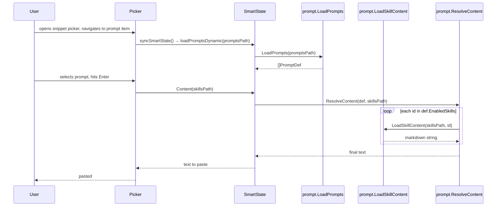

# Implementation Plan: zen-cap Prompt System Remake

## Summary

Replace the current hardcoded `promptDatabase` / single `prompts.yaml` sidecar in `pkg/snippet/smart_prompt.go` with a proper file-based prompt system that:
1. Sources prompt definitions from a configurable **`prompts_path`** directory (YAML files, one per prompt).
2. Sources skill markdown files from a configurable **`skills_path`** directory.
3. Parses `enabledSkills` on each prompt definition and injects skill content inline when the prompt is pasted.
4. Points by default at `/media/jang/home/Deve/web-reader-mcp-master/src/resources/prompts` and `.../skills`.

---

## Current State

| Item | Location | Problem |
|---|---|---|
| Prompt database | `smart_prompt.go` — two hardcoded Go slices | Cannot extend without recompile |
| Dynamic override | `loadPromptsDynamic()` — loads a single `prompts.yaml` beside `snippet_file` | Only one flat file, no skills awareness |
| `PromptRole` struct | `Name`, `Role`, `Job`, `Template`, `Tags` | No `enabledSkills`, no skill injection path |
| Config | `pkg/config/Config` | No `prompts_path` / `skills_path` fields |

---

## Target Architecture

```mermaid
flowchart TD
    CFG[config.json\npromptsPath / skillsPath] --> LOADER

    subgraph pkg/prompt
        LOADER[loader.go\nLoadPrompts] --> DEFS[([]PromptDef)]
        SKILL[skill.go\nLoadSkillContent] --> SKILLFS[(skills/*.md)]
        RESOLVER[resolver.go\nResolveContent] --> LOADER
        RESOLVER --> SKILL
    end

    DEFS --> PICKER[picker.go / smart.go\nSmartTypePrompt]
    PICKER -->|paste| RESOLVED[Expanded Text\n= template + injected skills]
```

---

## Data Model

### New `PromptDef` (replaces `PromptRole`)

```go
// pkg/prompt/types.go
type PromptDef struct {
    Name          string   `yaml:"name"`
    Description   string   `yaml:"description"`
    Role          string   `yaml:"role"`
    Job           string   `yaml:"job"`
    Template      string   `yaml:"template"`   // optional; overrides role+job default
    Tags          []string `yaml:"tags"`
    EnabledSkills []string `yaml:"enabledSkills"` // NEW: list of skill IDs to inject
}
```

### YAML file format (one file per prompt, or array in one file)

```yaml
# architect.yaml
- name: Senior Software Architect
  role: a Senior Software Architect ...
  job: review the provided code ...
  tags: [code, architecture]
  enabledSkills:
    - codebase-research
    - chat-research
```

### Skills directory convention

```
skills/
  codebase-research.md
  chat-research.md
  harness/
    SKILL.md          ← directory skill, load SKILL.md
```

---

## Config Changes

### `pkg/config/config.go`

Add two fields to `Config` struct:

```go
PromptsPath string `json:"prompts_path"` // abs path to prompts dir
SkillsPath  string `json:"skills_path"`  // abs path to skills dir
```

Default values pointing at web-reader-mcp-master resources:

```go
PromptsPath: "/media/jang/home/Deve/web-reader-mcp-master/src/resources/prompts",
SkillsPath:  "/media/jang/home/Deve/web-reader-mcp-master/src/resources/skills",
```

Add fallback logic in `readConfig()` (same pattern as existing empty-field checks):

```go
if cfg.PromptsPath == "" { cfg.PromptsPath = defaults.PromptsPath }
if cfg.SkillsPath  == "" { cfg.SkillsPath  = defaults.SkillsPath  }
```

### `config.json` (user file)

```json
{
  "prompts_path": "/media/jang/home/Deve/web-reader-mcp-master/src/resources/prompts",
  "skills_path":  "/media/jang/home/Deve/web-reader-mcp-master/src/resources/skills"
}
```

---

## New Package: `pkg/prompt`

Three small files, zero external deps beyond `gopkg.in/yaml.v3`.

### `pkg/prompt/types.go`
— `PromptDef` struct (above).

### `pkg/prompt/loader.go`

```go
// LoadPrompts reads all *.yaml / *.yml from promptsPath.
// Returns deduplicated slice keyed by Name (last write wins).
func LoadPrompts(promptsPath string) ([]PromptDef, error)

// loadYAML parses a single YAML file; accepts array or single object.
func loadYAML(path string) ([]PromptDef, error)
```

- Walks `promptsPath` for `*.yaml`/`*.yml`.
- Accepts both array-of-prompts and single-object formats.
- Falls back silently (logs warning) on parse error; never crashes.

### `pkg/prompt/skill.go`

```go
// LoadSkillContent returns the raw markdown for a skill ID.
// Checks: skillsPath/<id>.md, then skillsPath/<id>/SKILL.md.
// Returns ("", nil) if not found.
func LoadSkillContent(skillsPath, id string) (string, error)
```

### `pkg/prompt/resolver.go`

```go
// ResolveContent returns the final pasted text for a PromptDef.
// - If def.Template != "": uses template as-is, appends skill blocks.
// - Else: builds "You are a {role}.\nYour JOB is to {job}." + skill blocks.
func ResolveContent(def PromptDef, skillsPath string) string
```

Skill injection format (mirrors web-reader-mcp style):
```
---
<!-- SKILL: codebase-research -->
<skill markdown content>
```

---

## Changes to Existing Files

### `pkg/snippet/smart.go`

- Replace `PromptRole` references with `prompt.PromptDef`.
- `SmartState.promptMatches []PromptDef` (type change only).

### `pkg/snippet/smart_prompt.go`

- Delete `popularPrompts` and `promptDatabase` slices.
- Delete `loadPromptsDynamic()`.
- Replace with:
  ```go
  func loadPromptsDynamic(promptsPath string) []prompt.PromptDef {
      defs, err := prompt.LoadPrompts(promptsPath)
      if err != nil || len(defs) == 0 {
          return nil // no built-in fallback — file is authoritative
      }
      return defs
  }
  ```
- Update `resolvePromptQuery()` to receive `promptsPath` from caller.

### `pkg/snippet/smart.go` — `Content()` method

Replace the `SmartTypePrompt` branch:
```go
case SmartTypePrompt:
    if len(s.promptMatches) == 0 { return "" }
    def := s.promptMatches[s.promptIdx]
    return prompt.ResolveContent(def, skillsPath)
```

`skillsPath` needs to reach `Content()`. Two options:

| Option | Approach | Verdict |
|---|---|---|
| A | Pass `skillsPath` to `Content(skillsPath string)` | **Preferred** — explicit, no global state |
| B | Package-level `prompt.SkillsPath` var set at startup | Simpler call sites, hidden coupling |

**Chosen: Option A** — caller (picker) passes the path; no hidden state.

### `pkg/snippet/picker.go` — `syncSmartState`

Fetch the paths from config when initialising smart state for `SmartTypePrompt`:

```go
cfg := config.Get()  // or however config is accessed in picker
state.promptMatches = loadPromptsDynamic(cfg.PromptsPath)
```

---

## File Layout After Implementation

```
pkg/
  config/
    config.go         ← +PromptsPath, +SkillsPath
  prompt/             ← NEW package
    types.go
    loader.go
    skill.go
    resolver.go
  snippet/
    smart.go          ← type swap PromptRole→PromptDef, Content sig change
    smart_prompt.go   ← remove hardcoded DB, update loader call
    picker.go         ← pass cfg paths to smart state init
config.json           ← +prompts_path, +skills_path
```

---

## Sequence: Prompt Paste Flow



---

## Key Decisions & Alternatives

| Decision | Alternative Considered | Rejection Rationale |
|---|---|---|
| New `pkg/prompt` package | Extend `pkg/snippet/smart_prompt.go` | `snippet` is UI-layer; loader/resolver are pure data — wrong layer |
| Skills injected at paste-time | Pre-resolve at load-time | Load-time resolution wastes memory; skill files can be large |
| No built-in fallback prompts | Keep hardcoded DB as fallback | Forces `prompts_path` to be set properly; avoids stale built-ins masking config errors |
| Option A (explicit path param) | Global var for skillsPath | Explicit paths are testable; globals create hidden coupling |
| Point at web-reader-mcp resources by default | Copy files into zen-cap | Single source of truth; no duplication of YAML maintenance |

---

## Open Questions

1. **Config access in picker** — `picker.go` currently accesses config via a passed-in `cfg *config.Config`. Confirm it has the new fields accessible at `syncSmartState` call site.
A: Config is already passed to picker. It is accessible.
2. **Hot-reload** — Should `LoadPrompts` be called once at picker open, or re-read on every query keystroke? (Recommendation: once per picker open — tolerable staleness, no fs thrash.)
A: once per picker open
3. **Skill injection in `Content()`** — `LoadSkillContent` is synchronous file I/O on the UI goroutine. Files are small markdown, so acceptable for now.
A: This is acceptable.
---

## Implementation Order

1. `pkg/config/config.go` — add fields + defaults + readConfig fallbacks
2. `config.json` — add the two path entries
3. `pkg/prompt/types.go` — `PromptDef`
4. `pkg/prompt/loader.go` — `LoadPrompts`
5. `pkg/prompt/skill.go` — `LoadSkillContent`
6. `pkg/prompt/resolver.go` — `ResolveContent`
7. `pkg/snippet/smart.go` — type swap + `Content()` sig
8. `pkg/snippet/smart_prompt.go` — replace loader, remove hardcoded DB
9. `pkg/snippet/picker.go` — thread paths through smart state init
