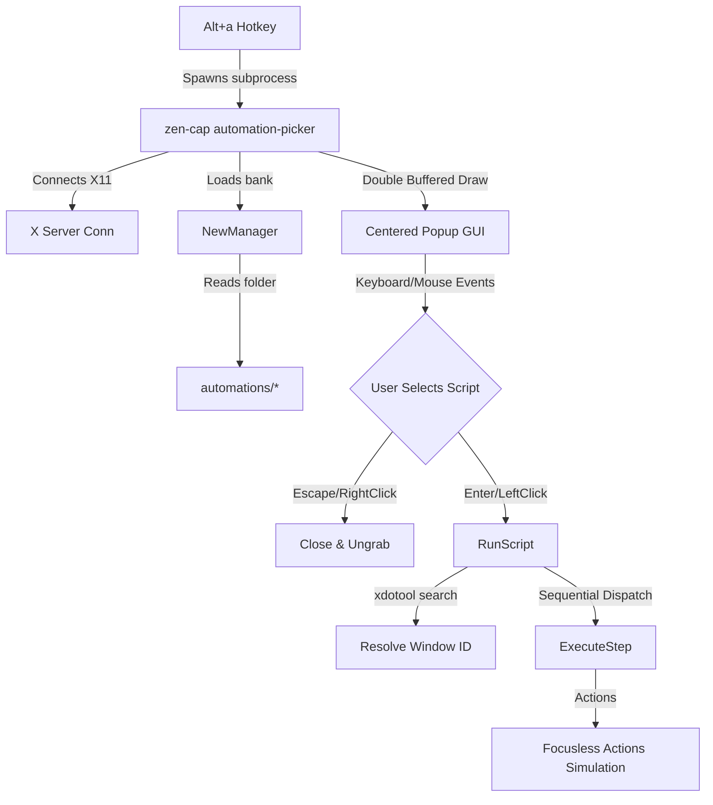

# Zen-Cap Desktop Automation Architecture Overview

Zen-Cap contains a native, YAML-based focusless automation engine that drives GUI actions without stealing keyboard/mouse focus. Below is the structural layout, component maps, and integration details.

---

## 1. File Structure

All source code resides inside `pkg/automation/` and is fully self-contained:

- **`types.go`**
  - Defines the core execution primitives: `Script`, `WindowTarget`, `Step`, and `ExecContext`.
  - Maps YAML fields into structured Go types.

- **`manager.go`**
  - Implements folder-based storage (`automation_bank`).
  - Scans files inside `automations/` and parses individual `.yaml` / `.yml` scripts.
  - Automatically seeds `automations/Example_Reward_Clicker.yaml` on first startup.
  - Features real-time disk polling and thread-safe hot-reloading using `sync.RWMutex`.

- **`engine.go`**
  - The core orchestrator.
  - Spawns the execution stack (`RunScript`), manages contexts, and translates relative windows using X11 `xdotool` query maps.

- **`actions.go`**
  - Implements the dispatch engine.
  - Simulates keyboard keypresses, typing, clicks, clipboard, command execution, and notification routing.
  - Translates visual matches dynamically.

- **`finder.go`**
  - Vision system.
  - Implements Sum of Absolute Differences (SAD) pixel template matching.
  - Integrates OCR substring text finding by querying `zen-lights` PaddleOCR JSON bounds.

- **`picker.go`**
  - The native X11 select GUI.
  - Implements custom `override_redirect` floaters, double-buffered screen rendering to eliminate flicker, scroll mechanics, and key navigation maps.

---

## 2. Dynamic Control Flow Architecture

---

## 3. Focusless Execution Design

To automate tasks while you work, Zen-Cap avoids taking cursor or desktop focus:
1. **Window Queries**: If `WindowTarget` is defined, `xdotool search --onlyvisible --class/--name` resolves the OS-level `WindowID`.
2. **Context Captures**: Screenshot routines capture frame buffers restricted to the coordinates of that `WindowID` natively.
3. **Vision Calculations**: Pixel and OCR matching results return coordinates relative to the target window frame.
4. **Input Simulation**:
   - `xdotool windowactivate --sync` is bypassed.
   - Mouse inputs target the window frame via: `xdotool click --window <id> --x <x> --y <y> <button>`.
   - Keyboard inputs target the input pipeline via: `xdotool type --window <id> "<text>"`.

---

## 4. Key Architectural Decisions

- **Subprocess Spawning for GUI Picker**: The global hotkey `Alt-a` triggers a quick standalone `zen-cap automation-picker` process. This isolates X11 GUI dependencies, avoids long-running resource leaks, and guarantees absolute daemon stability.
- **Double Buffering**: Graphic frames are fully pre-rendered in a memory `image.RGBA` canvas before uploading in chunks to an X11 `bufPixmapID`. This ensures perfectly smooth scrolling and UI navigation without screen tearing.
- **Folder-based Bank (`automation_bank`)**: Replacing monolithic files with single YAML files per script facilitates direct script sharing, prevents mass parsing corruptions, and allows scalable storage of embedded binary contents (like template image matrices).
